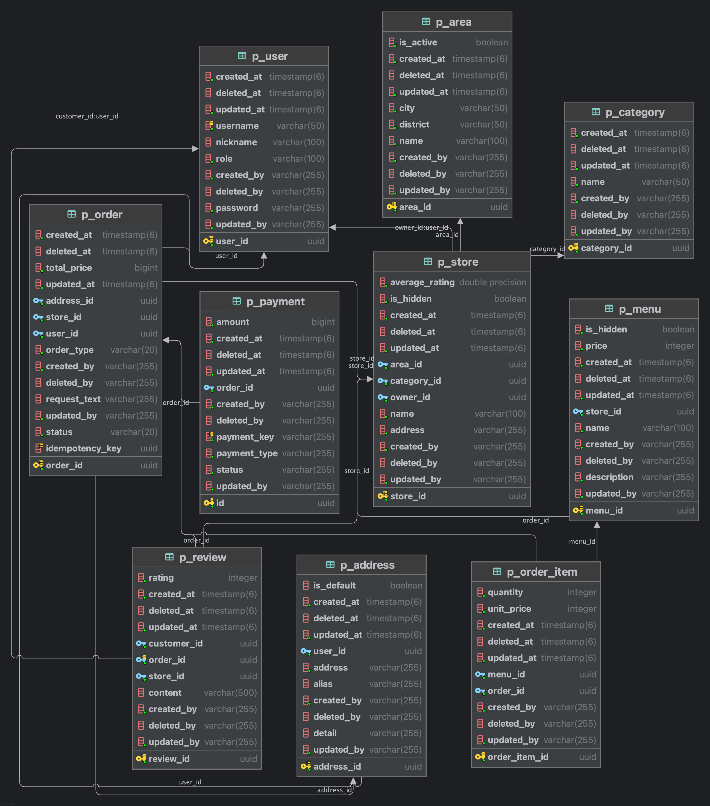
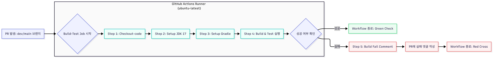
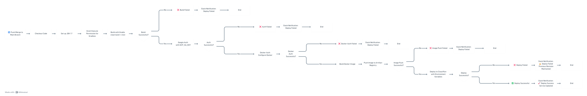
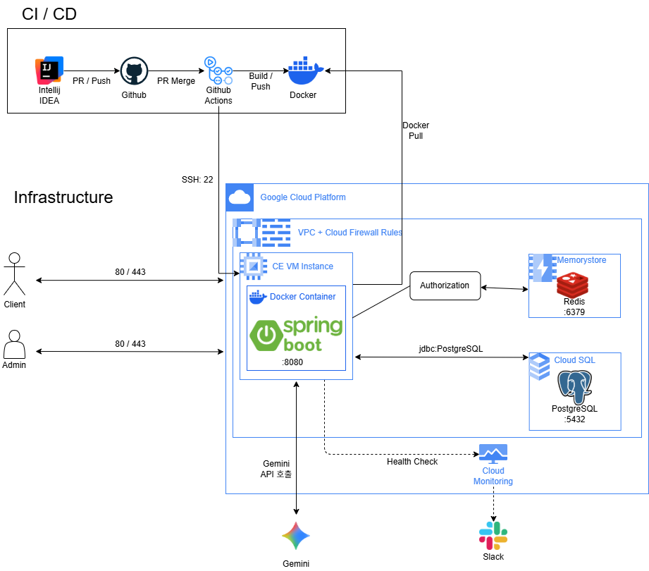

<div align="center">
  

  <h1>6CanDoEat (유켄두잇)</h1>


<hr />
  <p>Spring Boot 기반 음식점 배달 주문·결제·리뷰를 처리하는 백엔드 서비스입니다.</p>
</div>

---

## 목차

- [프로젝트 소개](#프로젝트-소개)
- [프로젝트 목표](#프로젝트-목표)
- [팀원 소개](#팀원-소개)
- [기술 스택](#기술-스택)
- [패키지 구조](#패키지-구조)
- [도메인 정의](#도메인-정의)
- [ERD 명세서](#erd-명세서)
- [API 명세서](#api-명세서)
- [인프라 아키텍처](#인프라-아키텍처)
- [시작하기](#실행-방법)

---

### 프로젝트 소개

Spring Boot 기반 음식점 배달 플랫폼 백엔드

- JWT 기반 인증/인가 및 역할 기반 권한 관리 (CUSTOMER / OWNER / MANAGER / MASTER)
- Gemini AI 기반 메뉴 설명 자동 생성
- Soft Delete 기반 데이터 관리 전략
- 주문 상태 흐름 관리 및 5분 이내 취소 정책

---

### 프로젝트 목표
- RBAC 기반 인증 아키텍처 및 이중 인가 체계 구축
- 컨테이너 기반 배포 환경 구축
- 결제 및 주문 시스템의 멱등성 보장과 동시성 제어

---

### 팀원 소개

|                    **박성우 (Leader)**                    |                        **김지민**                        |                         **박준식**                          |                          **서동원**                          |
|:------------------------------------------------------:|:-----------------------------------------------------:|:--------------------------------------------------------:|:---------------------------------------------------------:|
|  |  |  |  |
|        [@seongwop](https://github.com/seongwop)        |        [@SuJeKim](https://github.com/SuJeKim)         |       [@qkrwns1478](https://github.com/qkrwns1478)       |      [@won2dev-lab](https://github.com/won2dev-lab)       |
|                       주문·결제 / AI                       |                       사용자 / 배송지                       |                    가게·메뉴·카테고리 / 리뷰별점                     |                       인증·인가 / 운영지역                        |

---

### 기술 스택
| 분류       | 기술                                                                                                                                                                                                                                                                                                                                                                                                                                                                                                                                                |
|:---------|:--------------------------------------------------------------------------------------------------------------------------------------------------------------------------------------------------------------------------------------------------------------------------------------------------------------------------------------------------------------------------------------------------------------------------------------------------------------------------------------------------------------------------------------------------|
| Backend  |      |
| Database |                                                                                                                                                                                                                                                                                                                                                  |
| AI       |                                                                                                                                                                                                                                                                                                                                                                                                                                          |
| Infra    |                                                                                                                                                                                                                                       |
| Tools    |                                                                                                                                                                                                                                                                                                                                                           |                                                                                                                                                                                                                                                                                                                                                      |

---

### 패키지 구조

<details>
<summary>패키지 구조 보기</summary>

```
src/main/java
└── com
    └── team6
        └── backend
            ├── SixCanDoEatApplication.java
            ├── address
            │   ├── application
            │   │   └── service
            │   │       └── AddressService.java
            │   ├── domain
            │   │   ├── entity
            │   │   │   └── Address.java
            │   │   └── repository
            │   │       └── AddressRepository.java
            │   └── presentation
            │       ├── controller
            │       │   └── AddressController.java
            │       └── dto
            │           ├── request
            │           │   ├── AddressRequest.java
            │           │   └── AddressUpdateRequest.java
            │           └── response
            │               └── AddressResponse.java
            ├── ai
            │   ├── application
            │   │   └── AiService.java
            │   ├── domain
            │   │   ├── AiErrorCode.java
            │   │   ├── entity
            │   │   │   ├── AiRequestLog.java
            │   │   │   └── AiRequestType.java
            │   │   └── repository
            │   │       └── AiRequestLogRepository.java
            │   ├── infrastructure
            │   │   ├── GeminiClient.java
            │   │   └── dto
            │   │       ├── GeminiGenerateRequest.java
            │   │       └── GeminiGenerateResponse.java
            │   └── presentation
            │       └── dto
            │           ├── ProductDescriptionRequest.java
            │           └── ProductDescriptionResponse.java
            ├── area
            │   ├── application
            │   │   └── service
            │   │       └── AreaService.java
            │   ├── domain
            │   │   ├── entity
            │   │   │   └── Area.java
            │   │   ├── exception
            │   │   │   └── AreaErrorCode.java
            │   │   └── repository
            │   │       └── AreaRepository.java
            │   └── presentation
            │       ├── controller
            │       │   └── AreaController.java
            │       └── dto
            │           ├── request
            │           │   ├── AreaCreateRequest.java
            │           │   └── UpdateAreaRequest.java
            │           └── response
            │               └── AreaResponse.java
            ├── auth
            │   ├── application
            │   │   └── service
            │   │       ├── AuthService.java
            │   │       ├── TokenService.java
            │   │       └── UserDetailsServiceImpl.java
            │   ├── domain
            │   │   └── repository
            │   │       └── UserRepository.java
            │   └── presentation
            │       ├── controller
            │       │   └── AuthController.java
            │       └── dto
            │           ├── UserDetailsImpl.java
            │           ├── request
            │           │   ├── LoginRequest.java
            │           │   └── SignupRequest.java
            │           └── response
            │               ├── LoginResponse.java
            │               └── UserResponse.java
            ├── category
            │   ├── application
            │   │   └── service
            │   │       └── CategoryService.java
            │   ├── domain
            │   │   ├── entity
            │   │   │   └── Category.java
            │   │   ├── exception
            │   │   │   └── CategoryErrorCode.java
            │   │   └── repository
            │   │       └── CategoryRepository.java
            │   └── presentation
            │       ├── controller
            │       │   └── CategoryController.java
            │       └── dto
            │           ├── request
            │           │   └── CategoryRequest.java
            │           └── response
            │               └── CategoryResponse.java
            ├── global
            │   └── infrastructure
            │       ├── config
            │       │   ├── AuditorConfig.java
            │       │   ├── JpaAuditingConfig.java
            │       │   ├── QueryDslConfig.java
            │       │   ├── RedisConfig.java
            │       │   ├── SwaggerConfig.java
            │       │   └── security
            │       │       ├── config
            │       │       │   ├── PasswordEncoderConfig.java
            │       │       │   └── SecurityConfig.java
            │       │       ├── jwt
            │       │       │   ├── JwtAuthUtils.java
            │       │       │   ├── JwtAuthenticationEntryPoint.java
            │       │       │   ├── JwtFilter.java
            │       │       │   └── JwtUtil.java
            │       │       └── util
            │       │           └── SecurityUtils.java
            │       ├── entity
            │       │   └── BaseEntity.java
            │       ├── exception
            │       │   ├── ApplicationException.java
            │       │   ├── AuthErrorCode.java
            │       │   ├── CommonErrorCode.java
            │       │   ├── ErrorCode.java
            │       │   ├── ErrorResponse.java
            │       │   ├── GlobalExceptionHandler.java
            │       │   └── TokenErrorCode.java
            │       ├── redis
            │       │   └── RedisService.java
            │       ├── response
            │       │   ├── CommonSuccessCode.java
            │       │   ├── SuccessCode.java
            │       │   └── SuccessResponse.java
            │       └── util
            │           └── AuthValidator.java
            ├── menu
            │   ├── application
            │   │   └── service
            │   │       └── MenuService.java
            │   ├── domain
            │   │   ├── entity
            │   │   │   └── Menu.java
            │   │   ├── exception
            │   │   │   └── MenuErrorCode.java
            │   │   └── repository
            │   │       ├── MenuRepository.java
            │   │       ├── MenuRepositoryCustom.java
            │   │       └── MenuRepositoryCustomImpl.java
            │   └── presentation
            │       ├── controller
            │       │   └── MenuController.java
            │       └── dto
            │           ├── request
            │           │   ├── MenuRequest.java
            │           │   └── UpdateMenuRequest.java
            │           └── response
            │               └── MenuResponse.java
            ├── order
            │   ├── application
            │   │   ├── OrderCreateService.java
            │   │   └── OrderService.java
            │   ├── domain
            │   │   ├── OrderErrorCode.java
            │   │   ├── OrderStatus.java
            │   │   ├── entity
            │   │   │   ├── Order.java
            │   │   │   └── OrderItem.java
            │   │   └── repository
            │   │       ├── OrderItemRepository.java
            │   │       └── OrderRepository.java
            │   └── presentation
            │       ├── OrderController.java
            │       └── dto
            │           ├── OrderCancel.java
            │           ├── OrderCreateRequest.java
            │           ├── OrderItemCreateRequest.java
            │           ├── OrderItemResponse.java
            │           ├── OrderResponse.java
            │           ├── OrderStatusUpdate.java
            │           └── OrderUpdate.java
            ├── payment
            │   ├── application
            │   │   └── PaymentService.java
            │   ├── domain
            │   │   ├── Payment.java
            │   │   ├── PaymentErrorCode.java
            │   │   ├── PaymentRepository.java
            │   │   └── PaymentStatus.java
            │   ├── infrastructure
            │   │   ├── TossPaymentClient.java
            │   │   └── dto
            │   │       ├── TossPaymentConfirmRequest.java
            │   │       ├── TossPaymentConfirmResponse.java
            │   │       ├── TossPaymentRequest.java
            │   │       └── TossPaymentResponse.java
            │   └── presentation
            │       ├── PaymentController.java
            │       └── dto
            │           ├── PaymentConfirmRequest.java
            │           └── PaymentResponse.java
            ├── review
            │   ├── application
            │   │   └── service
            │   │       └── ReviewService.java
            │   ├── domain
            │   │   ├── entity
            │   │   │   └── Review.java
            │   │   ├── exception
            │   │   │   └── ReviewErrorCode.java
            │   │   └── repository
            │   │       └── ReviewRepository.java
            │   └── presentation
            │       ├── controller
            │       │   └── ReviewController.java
            │       └── dto
            │           ├── request
            │           │   └── ReviewRequestDto.java
            │           └── response
            │               └── ReviewResponseDto.java
            ├── store
            │   ├── application
            │   │   └── service
            │   │       └── StoreService.java
            │   ├── domain
            │   │   ├── entity
            │   │   │   └── Store.java
            │   │   ├── exception
            │   │   │   └── StoreErrorCode.java
            │   │   └── repository
            │   │       ├── StoreRepository.java
            │   │       ├── StoreRepositoryCustom.java
            │   │       └── StoreRepositoryCustomImpl.java
            │   └── presentation
            │       ├── controller
            │       │   └── StoreController.java
            │       └── dto
            │           ├── request
            │           │   └── StoreRequest.java
            │           └── response
            │               └── StoreResponse.java
            └── user
                ├── application
                │   └── service
                │       └── UserService.java
                ├── domain
                │   ├── entity
                │   │   ├── Role.java
                │   │   └── User.java
                │   ├── exception
                │   │   └── UserErrorCode.java
                │   └── repository
                │       └── UserInfoRepository.java
                └── presentation
                    ├── controller
                    │   └── UserController.java
                    └── dto
                        ├── request
                        │   └── UserInfoRequest.java
                        └── response
                            └── UserInfoResponse.java
```

</details>

---

### 도메인 정의

| 도메인      | 설명                           |
|:---------|:-----------------------------|
| Auth     | 회원가입 / 로그인 / 로그아웃 / 토큰 갱신    |
| User     | 사용자 관리                       |
| Area     | 운영 지역 관리                     |
| Category | 카테고리 관리                      |
| Store    | 가게 등록 및 관리                   |
| Menu     | 메뉴 관리 (AI 기반 메뉴 설명 자동 생성 지원) |
| Order    | 주문 생성 및 상태 관리                |
| Review   | 리뷰 및 별점 관리                   |
| Payment  | 결제 관리                        |
| Address  | 배송지 관리                       |

---

### ERD 명세서



---

### API 명세서

> **공통 사항**
> - Base URL: `http://{SERVER_URL}/api/v1`
> - 인증: JWT (`Authorization: Bearer {token}`), 회원가입·로그인 제외
> - Content-Type: `application/json`

[](https://editor.swagger.io/?url=https://raw.githubusercontent.com/6-can-do-eat/6-can-do-eat/dev/docs/swagger.yaml)

---

### 인프라 아키텍처

<details>
<summary>CI Flow</summary>



</details>

<details>
<summary>CD Flow</summary>



</details>

<details>
<summary>인프라 다이어그램</summary>



</details>

---

### 실행 방법

#### 환경 변수 설정 (.env)
프로젝트 루트 디렉토리에 `.env` 파일을 생성하고 아래 내용을 서비스 환경에 맞게 입력합니다.

```env
JWT_SECRET_KEY=your_secret_key_here
JWT_ACCESS_TOKEN_EXPIRATION=1800000
JWT_REFRESH_TOKEN_EXPIRATION=604800000
DB_URL=jdbc:postgresql://localhost:5432/your_db
DB_USERNAME=your_username
DB_PASSWORD=your_password
REDIS_HOST=localhost
REDIS_PORT=6379
SERVER_PORT=8080
TOSS_SECRET_KEY=your_toss_key_here
```

#### 로컬 실행

```bash
./gradlew build
./gradlew bootRun
```

#### Docker Compose를 이용한 실행

```bash
# 서비스 실행
docker-compose up -d

# 종료
docker-compose down
```